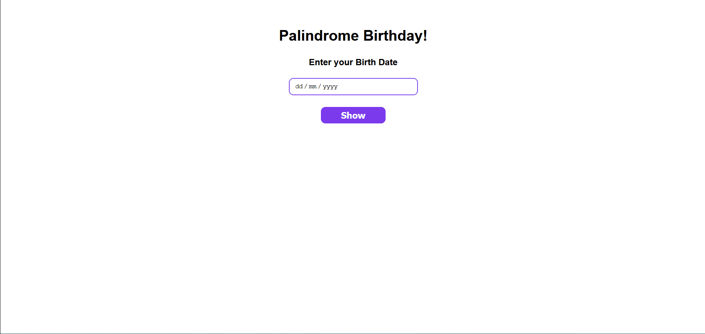

# neoG Camp - Palindrome Birthday

Tell your friends if their birthdate is a palindrome. If not, show the nearest palindrome date and how much days they are missing.

## Table of contents

- [Overview](#overview)
  - [Screenshot](#screenshot)
  - [Links](#links)
- [My process](#my-process)
  - [Built with](#built-with)
  - [What I learned](#what-i-learned)
- [Author](#author)

## Overview

### Screenshot



### Links

- [View live](https://palindromebirthday1.netlify.app/)

## My process

### Built with

- Semantic HTML5 markup
- [Sass](https://sass-lang.com/) - CSS extension language
- CSS Flexbox
- Vanilla JavaScript

### What I learned

Working with dates in JavaScript is scary, and I had to work with it in this project. I used `Date` object to get the date of next day provided the current date. It was complex but I managed to solve this problem using `getDate()` and `setDate()` methods.

Here is how

```js
const tomorrow = new Date(year, month - 1, day);

tomorrow.setDate(tomorrow.getDate() + 1);
```

I had to minus one from months because in JavaScript months starts with 0 and I was getting output for month December (12) as 00.

## Author

- Twitter - [@junaidshaikh_js](https://twitter.com/junaidshaikh_js)
- Linkedin - [@junaidshaikhjs](https://www.linkedin.com/in/junaidshaikhjs/)
